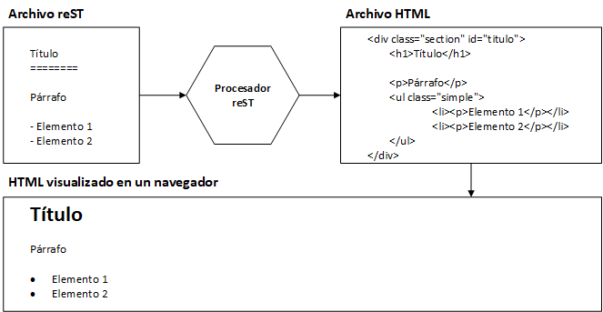
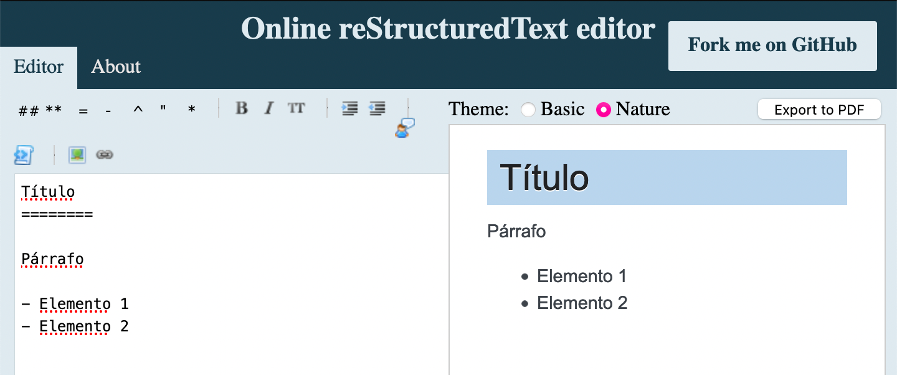

Primeros pasos
==============

Antes que nada, ¿qué es exactamente reStructuredText? Esto podemos definirlo en dos partes. La primera: reST es un lenguaje ligero de marcado de texto plano diseñado para ser fácil de leer y escribir. Sí, claro. Pero, para aquellos ajenos a sistemas computacionales, ¿qué significa toda esa verborrea?

*Texto plano* quiere decir que lo puedes editar en el bloc de notas, en una caja de texto en el navegador, o incluso en Microsoft Word, si así lo deseas. El punto es que no necesitas un editor en particular, solo es texto. Si copias de un lado y pegas en otro no hay problema, porque el texto no tiene formato que no puedas ver. Como un ejemplo de esto, tenemos los siguientes dos enunciados:

1. Este texto **contiene negritas**.
2. Este texto \*\*contiene negritas\*\*.

El primero no es texto plano porque el texto en negritas ya tiene formato. El segundo enunciado es texto plano porque no tiene formato (todo se ve igual), y se asume que el lector o escritor puede inferir que las estrellas (\*\*) dan el formato de negritas.

*Lenguaje de marcado* quiere decir que se utilizan símbolos para nombrar las características del texto. Volviendo al ejemplo de las negritas, podemos decir que el texto "contiene negritas" porque fue marcado con los símbolos "\*\*".

*Ligero* es para contrastar contra los lenguajes de marcado como HTML y XML. Si no los conoces, solamente digamos que son lenguajes muy poderosos, pero también fastidiosos y difíciles para trabajar, al menos al escribir como una persona lo hace. Como ejemplo, aquí el texto en negritas en reST y en HTML:

	``HTML``: Este texto <strong>contiene negritas</strong>.

	``reST``: Este texto \*\*contiene negritas\*\*.

En este breve ejemplo de negritas se observa una diferencia de ocho caracteres en "<strong>", nueve para "</strong>", contra dos de cada \*\*. Si con una sola instancia hablamos de trece caracteres menos, imagina si lo acumulas a lo largo de todo un documento.

Así que es ligero en dos sentidos: pesa menos bytes para la computadora al tener menos símbolos y es menos tedioso de escribir para nosotros los humanos.

*Fácil de leer y escribir* viene de las características anteriores. Sin tantos símbolos de mayor que y menor que, propios de los lenguajes de marcado como HTML, es más cómodo visualmente al estar leyendo. Además, los símbolos (como \*\*) dan una idea rápida del formato que se pretende que tenga el texto.

Pero, vale, ¿cómo le hacemos para que "\*\*" se transforme en texto en negritas?

Aquí es donde entra la segunda parte de la definición: reST es una herramienta para la conversión del lenguaje de marcado a otros formatos que sean de utilidad.

¿Es un lenguaje o una herramienta?
----------------------------------

Seamos claros, reST no es un formato que se vea bonito (es texto plano que no se ve tan feo). Lo que sí, es un lenguaje práctico que nos permite escribir de manera rápida y eficiente.

No obstante, reST no está diseñado para ser el formato final. Generalmente contamos como formato de salida una página web o un documento en PDF, a algún otro, donde reST definitivamente no figura.

Por lo tanto, necesitamos una forma de traducir lo que escribimos en reST al formato que de verdad queremos. Otra forma de decirlo es: sin un programa, herramienta, script, o lo que sea, que nos traduzca reST a un formato más común, reST es inútil.

Y así es como llegamos a esta dualidad: reST es tanto la herramienta que nos permite convertir lo que escribimos a un formato más conocido, así como la definición del significado de los símbolos que posteriormente serán convertidos. Esto se puede ver en la `figura 2.1`_.

.. _figura 2.1:

	Figura 2.1: Diagrama del proceso de compilado de reST.

Es decir, la `figura 2.1`_ nos permite ver el papel de reStructuredText en todo esto en cuatro pasos:

1. Se crea un archivo con extensión *rst*, que contiene texto plano marcado gracias a la sintaxis de reStructuredText.
#. Nuestro archivo pasa a través de un procesador de reST, el cual es un programa para traducir el texto plano con el marcado a otro formato. A lo largo de este libro asumiremos que el formato de salida es HTML.
#. Tenemos un archivo en HTML gracias al procesador, aunque ese formato no es muy amigable para los ojos humanos en su forma de texto plano.
#. Visualizamos el HTML en un navegador como Firefox o Chrome, y todos felices.

Esto empieza a sonar complicado, lo sé. ¿Cómo trabajamos con reST si necesitamos tantas partes?

Editor en línea
---------------

El diagrama de la `figura 2.1`_ se reduce a una acción: utilizar un `editor en línea`_. En la `figura 2.2`_ se pueden apreciar dos de los elementos:

#. El código reST del lado izquierdo.
#. El producto final en HTML, del lado derecho.

.. _figura 2.2:

	Figura 2.2: Editor en línea de reST.

Detrás, en grandes servidores, corre el procesador de reST, y tu navegador se encarga de mostrar adecuadamente el HTML. Por tanto, podemos concluir que la explicación anterior solo fue un agregado cultural (de nada), pero de ahora en adelante solo utiliza el editor en  `http://rst.ninjs.org/?theme=nature <http://rst.ninjs.org/?theme=nature>`_.

Llegados a este punto es necesario dejar en claro que, si deseas seguir los ejemplos que se plantean a lo largo del libro, requerirás de una computadora con conexión a Internet (no te preocupes, solo usaremos el `editor en línea`_ antes descrito).

Comparación con Markdown
------------------------

Markdown y reStructuredText pertenecen a la misma familia: ambos son lenguajes de marcado ligeros. Su objetivo es que no nos despeguemos del teclado para dar clic sobre algunos íconos para poner el estilo, y que todo el documento sea legible y rápido de escribir.

Markdown también es un formato a la vez que una herramienta para traducir a HTML. No obstante, Markdown es el hermano popular, el lenguaje de marcado más utilizado, y ha sido implementado a lo largo de muchas aplicaciones y sitios. Lo puedes usar en sitios de programación como GitHub y Bitbucket, y también hay extensiones para agregarlo a clientes de correo, y *frameworks* para la creación de sitios web como Jekyll_.

En fin, el ecosistema de Markdown es vasto, y sus implementaciones son cuantiosas... y ese es uno de los problema de Markdown. Resulta que John Gruber creó Markdown como una herramienta para convertir texto a HTML pensando en los escritores web. El invento causó furor y muchas personas empezaron a adaptarlo a sus necesidades. En un abrir y cerrar de ojos hubo más versiones de Markdown de las que eran convenientes.

En un intento de unificar todo, se creó el lenguaje CommonMark_ como base común, aunque aún hay variantes salvajes. Por ejemplo, GitHub tiene su propia variante (en lenguaje coloquial, *sabor*), llamada `GitHub Flavored Markdown`_ (GFM), que entre otras cosas añade el resaltado de sintaxis de código fuente.

Una de las cosas más molestas de tanta diversidad es el manejo de los espacios en blanco. Mientras para unos sabores el salto de línea significa un salto de línea en HTML, para otros significa permanecer en el mismo párrafo, y dos espacios al final de cada línea indican el salto de línea en HTML. Una ligera molestia, sin duda, a la que uno se puede adaptar.

Otro problema que tiene Markdown es que fue concebido para lidiar con un único documento. MultiMarkdown_ (MMD), otra versión ampliamente utilizada, agregó capacidad para incluir un documento dentro de otro, porque incluso la variante de GitHub no permite ésto. Además, MMD puede compilar a más formatos, como HTML y PDF (al igual que reST).

Entonces, si Markdown no tiene problemas porque hay variantes u otras herramientas que los resuelven, ¿por qué habríamos de elegir un lenguaje de marcado menos popular? Para dar la respuesta es necesario hablar de otra herramienta.

Su relación con Sphinx
----------------------

Si perdiste el piso con la historia de Markdown y sus mil y un sabores, imagina tener que explicar todo eso a tus superiores mientras intentas decir que toda esa maraña tecnológica es lo más apropiado para un sistema de documentación. Es aquí donde podemos mencionar algunas características de reStructuredText:

+ Mientras que Markdown se creó para lidiar con un archivo a la vez, reStructuredText hace uso de la directiva ``include`` para juntar varios archivos.
+ Mientras que Markdown no contemplaba código fuente (ya añadido por GFM), reST cuenta con la directiva ``code`` y muchas sintaxis.
+ Mientras que Markdown era un convertidor de pocas instrucciones, reST fue diseñado como un lenguaje extensible.

Y es en esa última palabra, *extensibilidad*, donde radica la diferencia. Esa capacidad de ser extendido es lo que dio lugar a Sphinx, un sistema completo para la documentación de un proyecto de software, capaz de generar un sitio web con capacidad de búsqueda, además de contar con convertidor a PDF y otros formatos. Sí, todo en un paquete, sin tanta historia.

Esto no es para decir que Sphinx y reST son superiores a Markdown y sus variantes dado que estamos en un punto donde ambos lenguajes de marcado son capaces de hacer lo mismo. Solo menciono las diferentes formas en que llegaron allí: Markdown fue evolucionando poco a poco, a través de variantes, y reST fue diseñado para ser extensible, nacido para documentar software.

No obstante, para usar Sphinx se requiere tener Python instalado localmente, para posteriormente descargar Sphinx y sus dependencias. Por este motivo, aunque Sphinx sea el procesador de reST al que se acude en la mayoría de los casos, solo utilizaremos el editor en línea.

¿Estamos programando?
---------------------

A lo largo de la obra uso la expresión "código fuente" o "lenguaje", quizá llegue a decir algo sobre "programación". Sin embargo, hacer uso de la sintaxis de reST no implica programación. Sí, tiene directivas, su sintaxis, produce cosas no esperadas si no colocas bien el nombre de directivas, si los espacios en blanco no están donde deberían... pero no.

No estamos programando, de ninguna manera. ¿Entonces por qué digo "código fuente"? Quizá es por costumbre. En programación, el "código fuente" es lo que el humano escribe, para que luego la computadora lo traduzca. En cierto sentido, nuestro documento de reST es lo que nosotros escribimos, para luego pasarlo a HTML. Quizá "texto fuente" sea más adecuado... pero es un lenguaje creado por programadores, y las costumbres son difíciles de erradicar.

No te inmutes si ves esos términos a lo largo de la obra. Solo me refiero a lo que escribimos en formato reST.

Resumen
-------

En este capítulo aprendimos que reST es tanto el lenguaje de marcado como la herramienta de traducción a otros formatos, y que lo podemos utilizar gracias a un `editor en línea`_.

También lo comparamos un poco respecto a Markdown, concluyendo que puedes hacer lo mismo con ambos lenguajes, aunque para documentar un proyecto puede ser mejor reST, dado que fue diseñado para ello.

Por último, hablamos de Sphinx, una herramienta que es como reST con esteroides, pero que no usaremos aquí debido a que requiere instalación local.

.. _editor en línea: http://rst.ninjs.org/?theme=nature <http://rst.ninjs.org/?theme=nature
.. _Jekyll: https://jekyllrb.com/
.. _CommonMark: https://commonmark.org/
.. _GitHub Flavored Markdown: https://github.github.com/gfm/
.. _MultiMarkdown: https://fletcherpenney.net/multimarkdown/